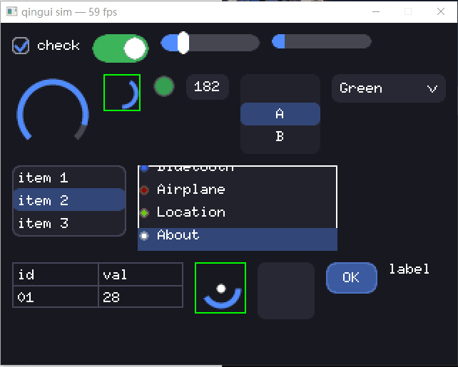

# qingui

轻量嵌入式 GUI 库（Rust, `no_std` + `alloc`），灵感来自 LVGL 的子集：Arena 对象树、PFB（局部帧缓冲）渲染、脏矩形、动画、按键焦点组。



## 特性

- **PFB 渲染**：调用方提供任意大小的像素缓冲（如 1/10 屏），RAM 占用与屏幕分辨率解耦，分块渲染 + `Flush` trait 推送
- **脏矩形**：属性变化自动标脏，只重绘变化区域（合并/裁剪/上限坍缩）
- **动画**：`tick_inc` 驱动的时间线动画，6 种 easing，支持 delay/repeat/playback/完成回调
- **按键交互**：仿 LVGL 的 keypad + 焦点组（group），Slider 编辑态、Switch 切换、List 项导航与滚动
- **控件**：Obj、Label、Button、Slider、Switch、Bar、List、Arc、Checkbox、Chart、Dropdown、Image、ItemList、Led、Msgbox、Roller、ScrollView、Spinbox、Spinner、Table、Custom
- **布局**：手动定位 + Flex（row/column、wrap、对齐）+ Grid（px/fr/content 轨道）
- **样式**：扁平样式结构 + 按状态（Pressed/Focused/Disabled）覆盖
- **字体**：多字体——embedded-graphics MonoFont，内置 FONT_6X10 默认，可插 eg 生态字体（ASCII，非 ASCII 回落 `?`）

## 快速开始

```rust
use qingui::display::Flush;
use qingui::input::Key;
use qingui::widgets::slider::SliderBuilder;
use qingui::{Color, Rect, Ui};

struct MyFlush;
impl Flush for MyFlush {
    fn flush(&mut self, area: Rect, pixels: &[Color]) {
        // 把 pixels 写入屏幕的 area 区域（RGB888）
    }
}

let mut ui = Ui::new(320, 240, 24); // 屏幕 320x240，PFB 缓冲 24 行
ui.set_flush(Box::new(MyFlush));

// Builder：默认尺寸/样式（通用 theme_base + 控件专属）可链式覆盖
let scr = ui.screen();
let slider = SliderBuilder::new(0, 100)
    .size(140, 14)
    .value(50)
    .style_with(|s| s.bg(Color::rgb(90, 90, 120)))
    .build(&mut ui, scr);
ui.set_pos(slider, 20, 20);

loop {
    ui.tick_inc(16);
    // ui.keypad_input(Key::Next); // 有按键时
    ui.timer_handler(); // 动画 → 布局 → 脏矩形渲染 → flush
}
```

## 示例（examples）

仓库内含 minifb 桌面模拟器（不发布到 crates.io）：

```
cargo run --example demo
cargo run --example gallery
```

- **demo**：控件总览——方向键/Tab 移动焦点，Enter 选择/进入编辑，Esc 退出编辑，Q 退出。绿色边框为脏矩形调试可视化。
- **gallery**：全部控件以 flex(wrap) 铺开，每 1s 末位前移（动画换位），交互控件自动演示（开关切换、进度随机、滚轮旋转、数值递增…）。

## 内存评估（memory benchmark）

零依赖内存评估，覆盖**静态类型尺寸**（`size_of` 表，含"最大变体税"——每个节点都按最大控件状态背负 `WidgetKind` 的大小）+ **运行时峰值堆**（三档场景的 peak/live + 阈值断言防回归）。

两种运行方式，同一套场景代码：

| 运行环境 | 命令 | ABI |
|---|---|---|
| host（64 位，快速回归） | `cargo bench -p qingui --bench memory` | `usize = 8B` |
| QEMU 裸机（真实 32 位） | `cd tools/qemu-mem && cargo run --release --target thumbv7em-none-eabihf` | `usize = 4B`（`-machine mps2-an386`，Cortex-M4F，semihosting 输出，退出码=断言结果） |

### 静态尺寸对比（host 64-bit vs QEMU thumbv7em 32-bit）

| 类型 | host (B) | QEMU 32 位 (B) |
|---|---|---|
| Rect | 16 | 16 |
| Point | 8 | 8 |
| Color | 3 | 3 |
| Style | 168 | 140 |
| ResolvedStyle | 144 | 112 |
| 4 × Style（旧内联成本） | 672 | 560 |
| **Node** | 376 | **280** |
| **WidgetKind** | 40 | **24** |
| largest inline state | 32 | 20 |
| discriminator 开销 | 8 | 4 |
| Ui | 248 | 152 |

各控件状态（`WidgetKind` 变体，List/ItemList/Roller 已装箱不计入枚举）：

| 状态 | host (B) | QEMU 32 位 (B) | | 状态 | host (B) | QEMU 32 位 (B) |
|---|---|---|---|---|---|---|
| Obj | 0 | 0 | | Spinner | 0 | 0 |
| Label | 24 | 12 | | Msgbox | 4 | 4 |
| Button | 24 | 12 | | Led | 4 | 4 |
| Slider | 12 | 12 | | Table | 32 | 16 |
| Switch | 1 | 1 | | Spinbox | 16 | 16 |
| Bar | 12 | 12 | | Roller | 56 | 40 |
| List | 152 | 112 | | ScrollView | 12 | 12 |
| Arc | 12 | 12 | | Dropdown | 32 | 16 |
| Checkbox | 32 | 16 | | Image | 24 | 16 |
| Chart | 32 | 20 | | ItemList | 184 | 152 |
| | | | | Custom | 16 | 8 |

### 峰值堆对比（场景表，peak=构造峰值 / live=树常驻）

| 档位 | 节点数 | host peak (B) | host live (B) | QEMU peak (B) | QEMU live (B) |
|---|---|---|---|---|---|
| minimal | 3 | 5,871 | 5,751 | 5,431 | 5,311 |
| small | 16 | 35,069 | 33,045 | 32,205 | 30,849 |
| medium | 50 | 70,800 | 60,736 | 59,476 | 52,380 |
| large | 140 | 209,576 | 159,496 | 165,516 | 128,588 |

32 位目标比 64 位 host 约低 20–25%：指针/引用（`Vec`/`String`/`Box`/`Option<usize>`）减半，但 `i32`/`u32` 固定字段不缩水，故非整体减半。QEMU 侧用自研静态 arena + 计数分配器（`tools/qemu-mem/src/allocator.rs`），`dealloc` 真实复用，peak/live 才有意义；回归测试见 `cargo test -p qemu-mem`（host 端跑同一套场景逻辑 + 分配器完整性校验）。

## License

MIT OR Apache-2.0
